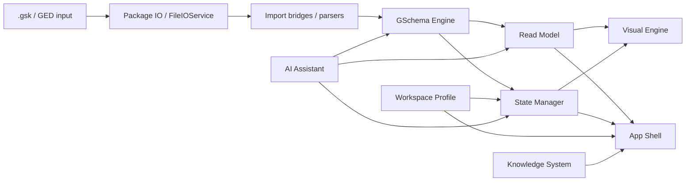

# GSK Ecosystem Architecture Analysis

Generated: 2026-03-06
Scope: TODOs 100, 101, 102, 103, 104
Basis notes: N0010, N0011

## 1. System Taxonomy Baseline

| Canonical system | Role | Current implementation anchors | Current aliases / ambiguous labels | Naming assessment |
| --- | --- | --- | --- | --- |
| `GSchema Engine` | In-memory graph semantics, invariants, journal-backed state | `src/core/gschema/GSchemaGraph.ts`, `src/core/gschema/GraphMutations.ts` | motor, GSchemaGraph, graph core | Keep role-based canonical name; implementation type can remain `GSchemaGraph`. |
| `GSK Package IO` | Package import/export and persistence boundary for `.gsk` | `src/core/gschema/GskPackage.ts`, `src/io/fileIOService.ts` | formato GSK, package IO, file IO | Split role is clear: format/package boundary, not engine. |
| `GEDCOM IO` | Legacy/interchange import/export boundary | `src/core/gedcom/*`, `src/io/fileIOService.ts`, `src/core/gschema/GedcomBridge.ts` | GED import/export, bridge | Keep as IO/interchange, not core semantics. |
| `Read Model` | Projection of graph state into UI/consumer document shape | `src/core/read-model/selectors.ts`, `src/core/read-model/directProjection.ts` | selectors, projection layer, direct/legacy projection | Canonical role should be `Read Model`; `direct`/`legacy` are strategies, not system names. |
| `Visual Engine` | Tree/canvas rendering and layout runtime | `src/views/DTreeViewV3.tsx`, `src/views/dtree-v3/*`, `src/core/dtree/*` | DTree V3, canvas, tree renderer, UI tree | Keep `Visual Engine` as role name; `DTree V3` is the current implementation. |
| `App Shell` | Panels, chrome, navigation, modal orchestration | `src/App.tsx`, `src/ui/*`, `src/ui/shell/*` | UI, shell, panels | `App Shell` is the clearer boundary; `UI` is too broad as a canonical system name. |
| `State Manager` | Reactive session coordination and cross-slice app state | `src/state/store.ts`, `src/state/slices/*` | Zustand store, store, app state | Keep role-based canonical name; `Zustand` is implementation detail. |
| `AI Assistant` | AI orchestration, extraction, review, safety, provider runtime | `src/core/ai/*`, `src/services/aiRuntime.ts`, `src/hooks/useAiAssistant.ts`, `src/ui/ai/*` | IA, copiloto, AI layer | Keep `AI Assistant` as user/system name; provider/runtime modules remain implementation details. |
| `Workspace Profile` | Local per-graph user preferences outside `.gsk` | `src/io/workspaceProfileService.ts`, `src/types/workspaceProfile.ts` | local profile, persisted view prefs | Clear separate system; should not collapse into package IO or state manager. |
| `Knowledge System` | Wiki/help/documentation surfaced inside app | `src/ui/WikiPanel.tsx`, docs trees | wiki, docs | Valid as optional named subsystem if kept as product-facing concept. |

## 2. Dependency Flow Map

### Primary runtime flow

### Current key dependency observations

- `useGskFile.ts` crosses IO, engine load, read-model projection, store hydration, and workspace profile application in one orchestration path.
- `selectors.ts` is the live boundary between `GSchema Engine` and consumer-facing projected documents, with `direct` and `legacy` strategies behind one API.
- `docSlice.ts` mixes state management concerns with engine mutation and immediate read-model reprojection.
- `App.tsx` coordinates both App Shell and Visual Engine concerns while also touching workspace profile persistence and graph projection.
- `AI Assistant` currently consumes projected documents and can route actions back through graph/state boundaries.

## 3. Format vs Engine Boundary Audit

### What belongs to format / package IO

- zip/container semantics of `.gsk`
- manifests and package metadata
- import/export strictness
- persistence and interchange boundaries
- GEDCOM parsing and serialization

### What belongs to engine semantics

- graph node/edge state
- journal sequence and invariants
- mutation semantics
- claims, preferred values, and graph-level consistency

### Leakage points observed

1. `useGskFile.ts`
- imports `.ged` or `.gsk`
- immediately bridges into graph form
- then also handles read-model projection concerns and profile hydration
- this is orchestration-heavy and mixes package boundary with app runtime concerns

2. `GedcomBridge.ts`
- still acts as both compatibility bridge and semantic translator
- legitimate for interchange, but risky as a long-term central dependency for product flows

3. `selectors.ts`
- still allows `legacy` projection fallback at the central read-model boundary
- that is not a format concern, but it affects architecture clarity because compatibility logic is still near the main projection entrypoint

### Boundary verdict

- The `.gsk` format should be treated as a persistence/package boundary, not as the semantic center of the application.
- The engine can conceptually outlive or vary independently from `.gsk`, but the current orchestration still contains package-to-runtime coupling that should be reduced over time.

## 4. Boundary vs Coupling Classification

| Relationship | Classification | Why |
| --- | --- | --- |
| `.gsk` package IO -> GSchema Engine` | Legitimate boundary | Persistence must materialize engine state somehow. |
| `GEDCOM bridge -> GSchema Engine` | Transitional bridge | Needed for import/export compatibility, but should not dominate product runtime semantics. |
| `GSchema Engine -> Read Model` | Legitimate boundary | Projection is a real system boundary between graph semantics and consumer/UI shape. |
| `Read Model -> Visual Engine` | Legitimate boundary | Visual rendering should consume projection, not raw graph internals. |
| `Read Model -> App Shell` | Legitimate boundary | Panels/search/timeline need projected documents. |
| `State Manager -> GSchema Engine` | Transitional bridge | The store currently holds live graph state and also orchestrates mutations; may remain, but needs cleaner separation. |
| `State Manager -> Read Model` | Transitional bridge | Store triggers projection and caches expansion state; acceptable now, but mixed responsibilities remain. |
| `App Shell -> Workspace Profile` | Legitimate boundary | UI preferences and local persistence are distinct and expected to interact. |
| `AI Assistant -> Read Model` | Legitimate boundary | AI needs a consumable document view for reasoning and matching. |
| `AI Assistant -> Engine mutation path` | Transitional bridge | Valid, but should go through stable public boundaries and auditable flows. |
| `App.tsx` touching projection, profile, Visual Engine, and shell concerns` | Technical debt / coupling | Too many orchestration responsibilities concentrated in one product root. |
| `docSlice.ts` mixing store, engine mutation, and projection refresh` | Technical debt / coupling | This is a real coupling hotspot and a candidate for architectural cleanup later. |
| `selectors.ts` central legacy fallback` | Technical debt / coupling | Necessary today, but explicitly a blocker/debt for the future hard cut. |

## 5. Implications for 099

`099` should not start from zero. It should consume this baseline in order:

1. Canonical system list and names
2. Dependency flow map
3. Format-vs-engine boundary decisions
4. Coupling classification

That sequencing reduces the risk of turning the hard cut into an improvised migration.

## 6. Recommended Ordering

- `100` umbrella first
- `101` taxonomy baseline first among children
- `102` dependency flow map second
- `103` format vs engine boundary audit third
- `104` boundary vs coupling classification fourth
- `099` only after `100` is complete

## 7. Summary Verdict

The project already contains the right architectural pieces to separate engine, projection, visualization, shell, state, IO, and AI. The problem is not missing systems; it is that some orchestration paths still blur them.

The most important foundational move before deeper 0.6.0 work is to treat:
- `N0010` as the naming/taxonomy baseline
- `N0011` / `100` as the interconnection and architecture baseline

That gives `099` a real substrate instead of making it rediscover architecture while trying to delete legacy paths.
